# Vertica Project(English)
Note: this application is to work with agent server.  
Please refer to:  

    https://github.com/Migorithm/migo_server_management_agent

## What is it?
"Vertica" in "Vertica Project" is just to follow the name of a team, so it's not so much meaningful as nominal.  

What it really does is provide Master-Agent communication through ***RESTful*** api with due regard to security as well as user's convenience.  

Here, Master server is in charge of taking user request through web api, processing it and sending it off to agent server.  

And then agent server gets the request from master and execute the requested call on the server.  

Then, why not use Ansible or some other configuration management application? There are several reasons:
- They're too infra-specific.
- Internally, they use ssh protocol except for some other Master-agent program like puppet or Saltstack. Therefore, there is no blocking logic in the agent side from malcious user who tries to get into its system, resulting in security issue.
- Learning them itself requires some amount of learning curve. 

## Main features
### 1. Operation on agent servers 
Say you have managed clusters - not just one but hundreds!. To top it off, it's not just one solution but multiple solution(In this project, it's **Elasticsearch** and **Redis**).  

Given this situation, you first select solution, and then this application shows you a list of clusters that belong to the solution. You select one of them, then it will give you a list of nodes in a "checkable" form.  

All this happens asynchronously.:
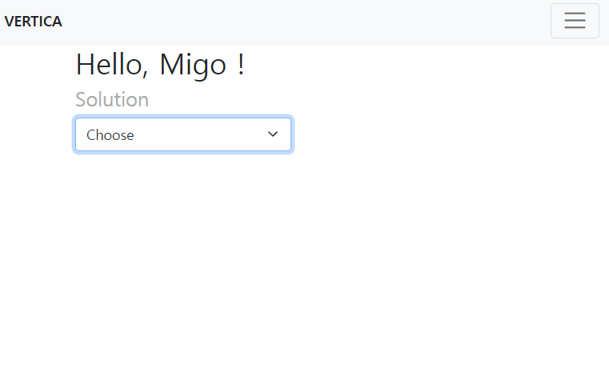  
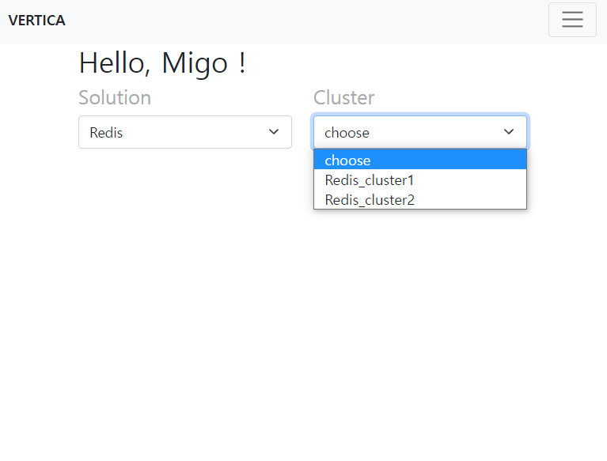  
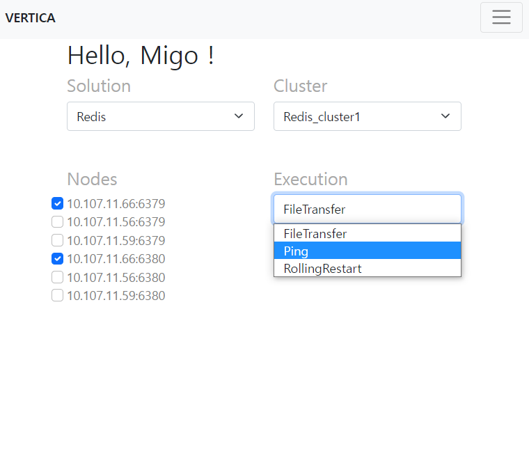  
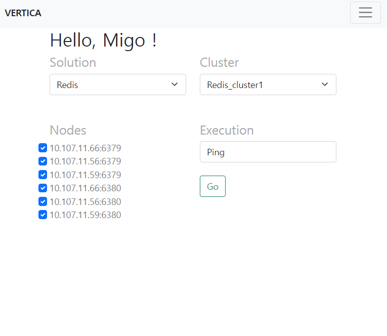  
  

As you can see, every solution will have different types of exeucution and for the each cluster, they will have different authentication method, that will be covered later. 

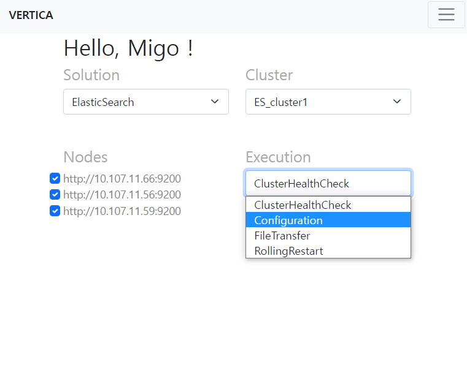  

#### Rolling restart
One of the biggest catalysts of the project was rolling restart which, in fact, sometimes takes whopping 7hours to complete(your Elasticsearch cluster, for example, can be as big as 30 nodes in size.)  

When you exectute RollingRestart, your master server will first check if cluster health is "green" before they execute it. they it gets the "green-light", it will proceed, logging:

    Cluster health green! Continue rolling restart...
    [SUCCESS] Agent : http://agentIP:PORT executed Restart...

And to make sure the whole cluster is up and running in green status, after restarting the server, it keeps the health in check. If interested in how it works, refer to:

    app/core_features/ES.py

#### Configuration modification
Logging in on to each server when configuration modification is required is such a pain. And that's where I came up with the idea of using RESTful service to modify it too that resembles just like how modification in AWS works.  

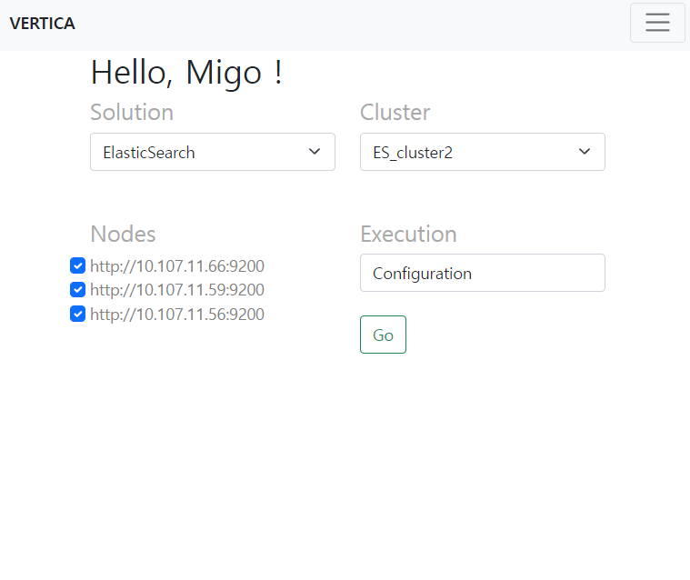  

This time, you chose "Configuration" from Execution select field and press "Go" button. It will then show you the following:

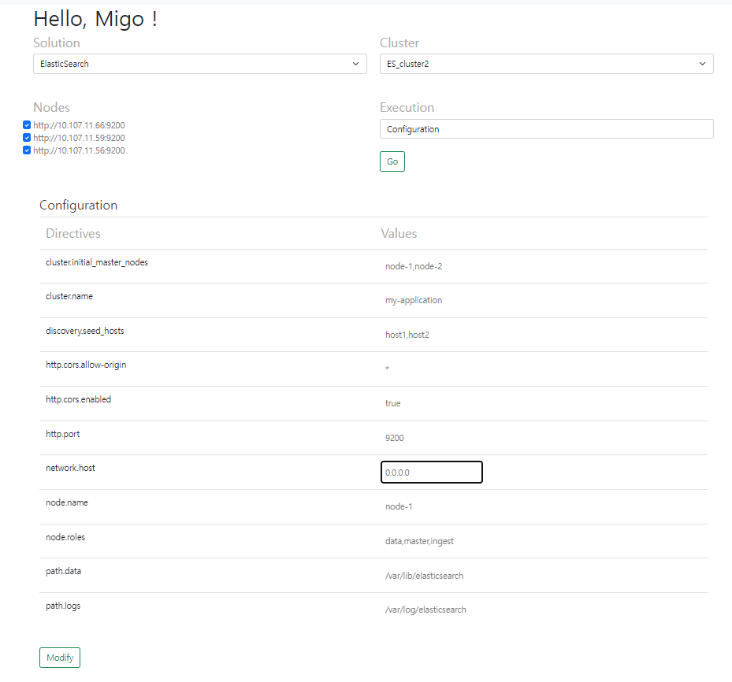  

As you can see, you can freely change the configuration for Elasticsearch and it will save it on the agent node(where you have Elasticsearch up and running).  

The following is how it was stored on agent node. 
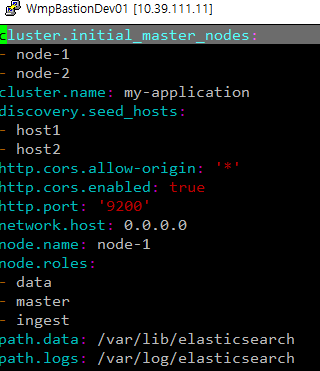  

### 2. Operation history
You may want to also keep track of what operations you and other users have executed. For that, I created table:  

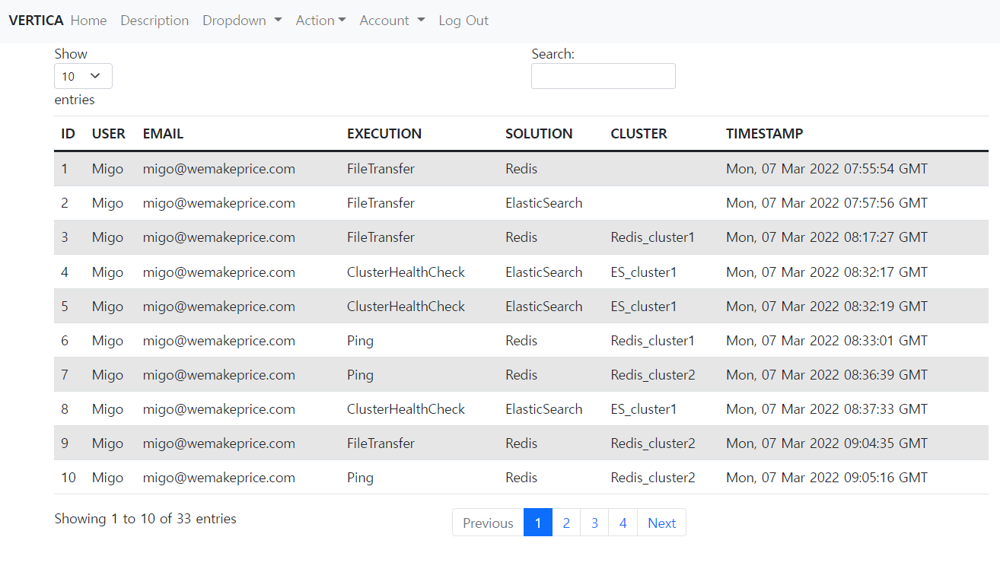  

Asynchronously, you can search for:
- who made it.
- what was executed.

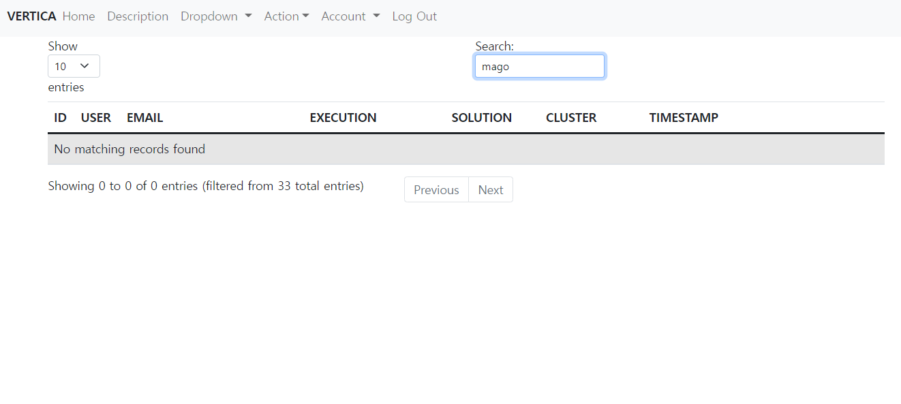 
There may be id "mago" but there is no history of them executing any of the operation.  

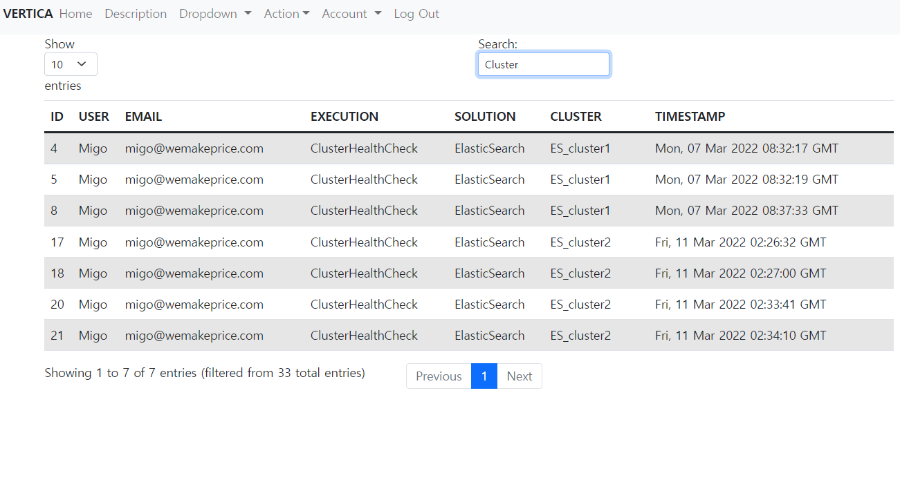 
You collect operation history of only "ClusterHealthCheck". Notice that even before you finish off the typing, it shows you. In fact, I didn't even press ENTER key. 

### 3. Security
#### Master-side
- (User registration) Using one-way cryptographic transformation(itsdangerous), user password can't be read unless you know authentic password. 

- (Session management) a session can last only for 30 minutes.

- (User account confirmation) The account must be confirmed by proper email. To send user back to proper url link, **JWT** was used. 

- (Access Control List) If the user is not granted some privilges, there is very little they can do in a certain page. Here, they can't execute any of operations. 

- (Protection against CSRF - cross-site request forgery) using security token and applying them to all web form, it projects all the user form from CSRF

- (Request tokenization) When sending a request to agent, they also send a token which authenticate the master.

#### Agent-side
- (From Master Only) It can get traffic only from master

- (No use of subprocess) Subprocess is intrinsically insecure. With that said, service management require system management. To reconcile two requirements, I used pystemd to leverage service Unit

- (Verifying token from master) When receiving a request and token, it not only checks master ip but also token it gets. 

### 4. Login page
Login_required function is implemented so when any of the endpoints require user being logged in, it redirected to login page and once you login in, you'll be pushed back to the page you originally wanted to go on. 
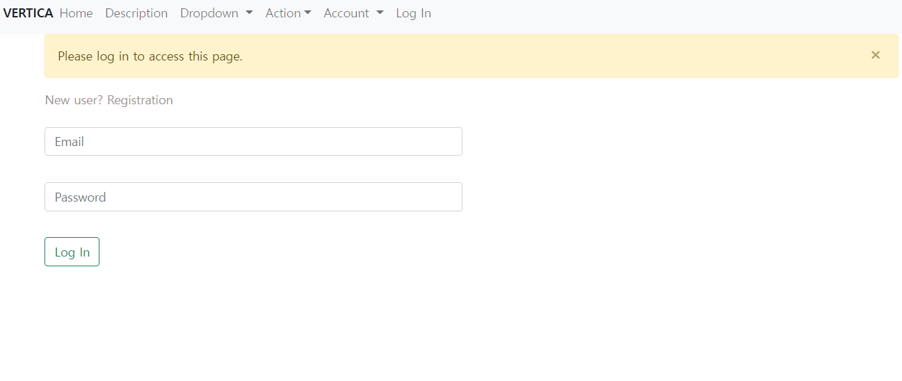

### 5. Registration page
You can limit the hostname by configuring "DOMAIN" environment variable. In this project, it's "wemakeprice.com". So any registration request with different domain will be rejected 
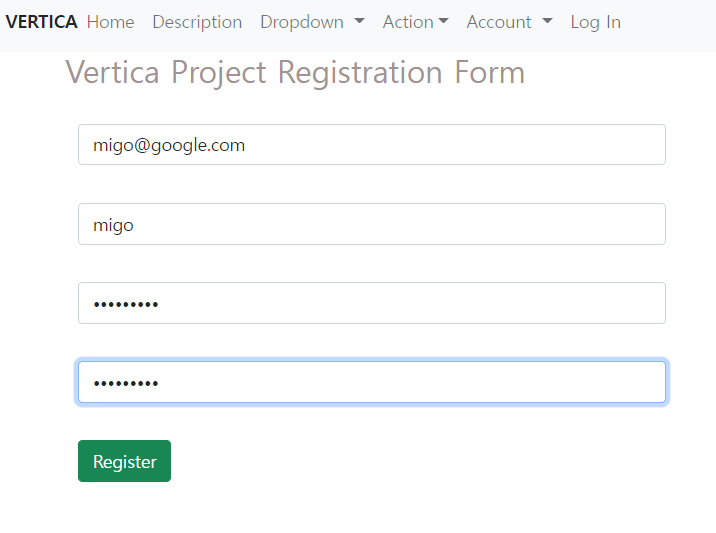  
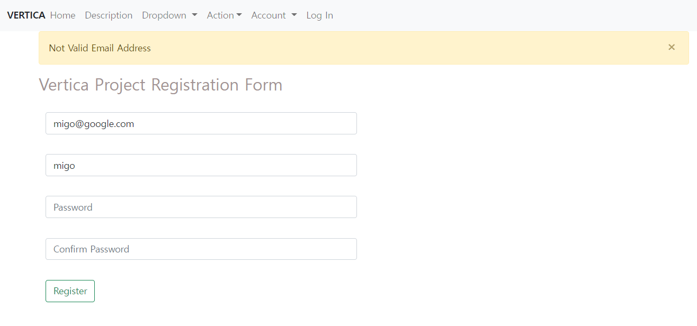  

If you put the correct domain name, they will send a confirmation mail to the given email.  

### 6. Redistribution of Agent Server application
Assuming you deploy this application in production servers where outbound network connectivity is not allowed, deploying the agent application will be tedious and error-prone. 

To get around to it, this application provides version match check and if not matched, allows you to deploy the agent application again to specified servers.  
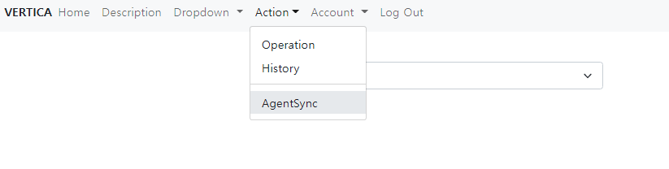  
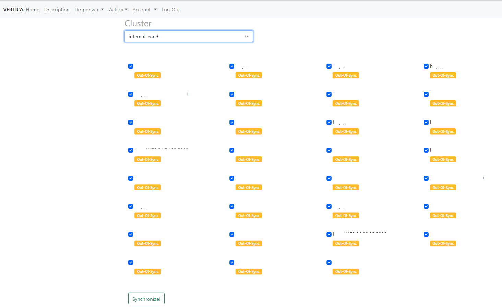  

As you can see, if your agent servers(or cluster) are out of sync, you can simply click 
"syncronize" button then it will result in the following: 
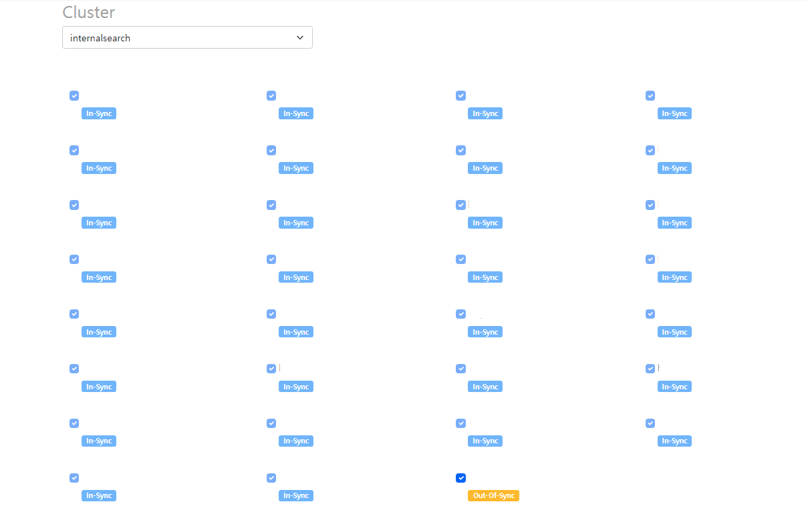  

Note that IP and ports are blanked for the security reason. 

