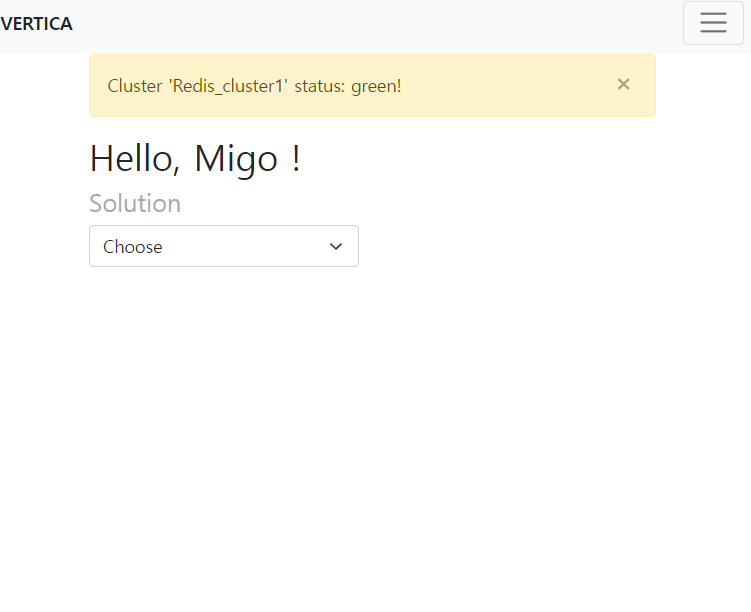

## Vertica Project(English)
Note: this application is to work with agent server. <br>
Please refer to:  

    https://github.com/Migorithm/migo_server_management_agent

### What is it?
"Vertica" in Vertica follows the name of a team, so it's not so much meaningful as nominal.<br><br>

What it really does is provide Master-Agent communication through ***RESTful*** api with due regard to security as well as user's convenience.<br><br>

Here, Master server is in charge of taking user request through web api, processing it and sending it off to agent server.<br><br>

And then agent server gets the request from master and execute the requested call on the server.<br><br>

Then, why not use Ansible or some other configuration management application? There are several reasons:
- They're too infra-specific.
- Internally, they use ssh protocol except for some other Master-agent program like puppet or Saltstack. Therefore, there is no blocking logic in the agent side from malcious user who tries to get into its system, resulting in security issue.
- Learning them itself requires some amount of learning curve. 

### Main features
#### 1. Operation on Server
Say you have managed clusters - not just one but hundreds!. To top it off, it's not just one solution but multiple solution(In this project, it's **Elasticsearch** and **Redis**).<br><br>

Given this situation, you first select solution, and then this application shows you a list of clusters that belong to the solution. You select one of them, then it will give you a list of nodes in a "checkable" form.<br><br>

All this happens asynchronously.:
<br><br>
<br><br>
<br><br>
<br><br>

#### Login page
Login_required function is implemented so when any of the endpoints require user being logged in, it redirected to login page and once you login in, you'll be pushed back to the page you originally wanted to go on. 


### Configuration & Environment variable
You should put any credentials and sensitive infomration into environment variable.<br>
In this project, I used ".flaskenv" for it.<br><br>

Information that should be kept under wrap is:
- "AUTH_" for authentication of ES cluster id and password
- "SECRET_KEY" for flaskform and JWT
- "AGENT_KEY" for master-agent confirmation
- "ADMINS" to register admin mail
- "DOMAIN" to block any other users who has no specified domain in their email from registration
- "MAIL_SERVER" for SMTP
- "SOLUTION" to specify managed solution and its constituent clusters and nodes

<br><br>


#### app.execs.py
With builder pattern applied, this is where you define available execution for each solution. Take ElasticSearch for example:
```python
class ElasticDirector:
    "Elastic Director that can build a complex representation."
    @staticmethod
    def construct():
        """Constrcut and return the final product."""
        return ExecutableBuilder()\
            .set_solution_type("ElasticSearch")\
            .set_executable("RollingRestart")\
            .set_executable("FileTransfer")\
            .set_executable("ClusterHealthCheck")\
            .get_result()
```
If you want to add more functionality, you can simply modify the return part by setting **".set_executable("command you want")"**
<br>

And then, you can have the feature registered to ***Execution*** model: 
```python
class Execution(db.Model):
    ...
    ...

    @staticmethod
    def insert_execution():
        REDIS= RedisDirector.construct() #dict - solution, execution
        ELASTIC = ElasticDirector.construct() #dict 
        SOLUTIONS=[REDIS,ELASTIC]
        for sol in SOLUTIONS:
            for exe in sol["execution"]:
                execution = Execution.query.filter_by(name=exe,solution=sol["solution"]).first()
                if execution is None:
                    execution = Execution(name=exe,solution=sol["solution"])
                db.session.add(execution)
            db.session.commit()
```
<br>

As you can imagine, you can simply get into flask shell and execute the following:
*flask shell*:
```python
a= Execution()
a.insert_execution()
```


